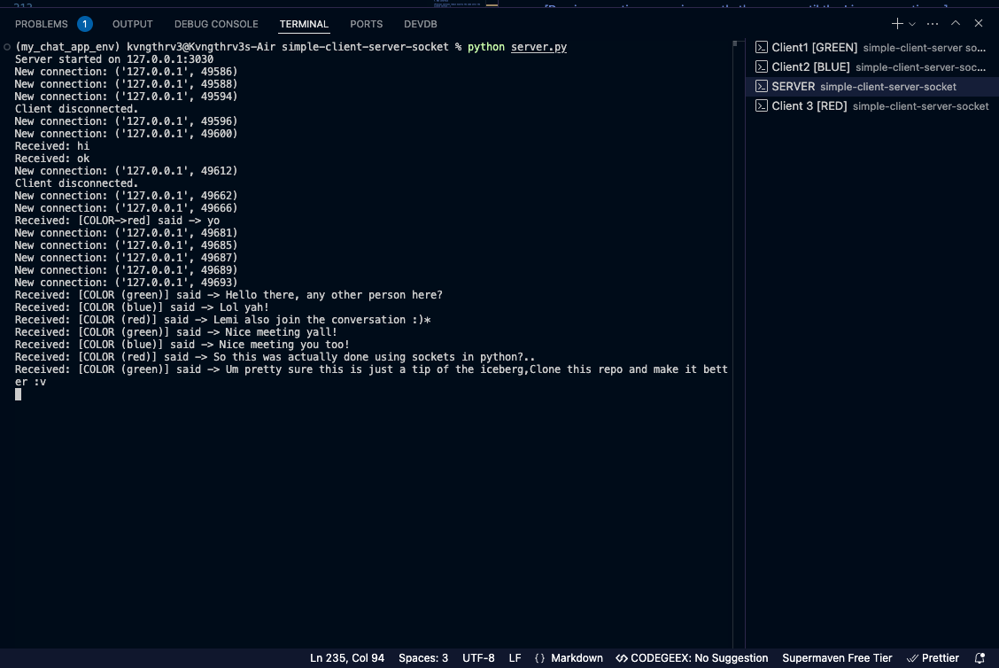
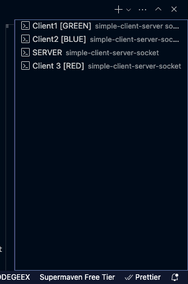
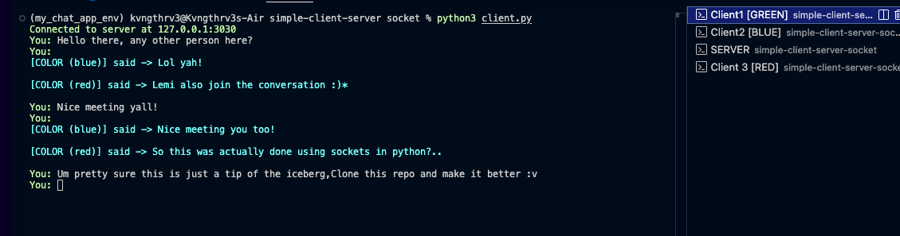

# Simple Client-Server Socket Chat
A lightweight chat application implementing a colored-message chat system using Python sockets with support for multiple concurrent clients.

## Project Structure
```
simple-client-server-socket/
├── my_chat_app_env/        # Virtual environment directory
├── demo-images/        # Demo images directory
├── client.py              # Client implementation
├── server.py             # Server implementation
├── requirements.txt      # Project dependencies
└── .gitignore           # Git ignore rules
```

## Getting Started

### System Requirements
- Python 3.x
- Terminal or Command Prompt
- Git (for cloning the repository)

### Installation and Setup

1. Clone the repository:
```bash
git clone https://github.com/zaidanali028/simple-client-server-socket.git
cd simple-client-server-socket
```

2. Create and activate the virtual environment:
```bash
# Windows
python -m venv my_chat_app_env
my_chat_app_env\Scripts\activate

# Linux/MacOS
python3 -m venv my_chat_app_env
source my_chat_app_env/bin/activate
```

3. Install dependencies:
```bash
pip install -r requirements.txt
```

### Running the System

1. Start the server:
```bash
# Open a terminal window
python server.py
```
You should see: `Server started on 127.0.0.1:3030`

2. Start multiple clients (in separate terminal windows):
```bash
python client.py
```
You should see: `Connected to server at 127.0.0.1:3030`

### Testing the Chat System

1. Basic Communication Test:
   - Start the server
   - Launch 2-3 client terminals
   - Send messages from each client
   - Verify all other clients receive the messages

2. Color Testing:
   - Modify client colors in different terminals:
     ```python
     # In client.py
     client = ChatClient(color="red")    # First terminal
     client = ChatClient(color="blue")   # Second terminal
     client = ChatClient(color="green")  # Third terminal
     ```

## Implementation Details

### Dependencies
- `termcolor`: For colored text output in the terminal
- Python's built-in `socket` and `threading` modules

### Server Implementation (`server.py`)

#### Class: `ChatServer`

##### Attributes
- `host` (str): Server IP address (default: "127.0.0.1")
- `port` (int): Server port number (default: 3030)
- `server_socket` (socket.socket): Main server socket
- `clients` (list): List of connected client sockets

##### Methods

###### `__init__(host="127.0.0.1", port=3030)`
Initializes the chat server with specified host and port.

###### `start_server()`
- Starts the server and listens for connections
- Creates new thread for each client connection
- Handles up to 5 queued connections

###### `handle_client(client_socket)`
- Manages individual client communications
- Receives and processes client messages
- Handles client disconnection

###### `broadcast_message(message, sender_socket)`
- Broadcasts messages to all connected clients except sender
- Handles message encoding and delivery

### Client Implementation (`client.py`)

#### Class: `ChatClient`

##### Attributes
- `host` (str): Server IP address (default: "127.0.0.1")
- `port` (int): Server port number (default: 3030)
- `color` (str): Client's message color
- `client_socket` (socket.socket): Client's socket connection

##### Methods

###### `__init__(host="127.0.0.1", port=3030, color="blue")`
Initializes the chat client with server details and message color.

###### `connect_to_server()`
- Establishes connection with server
- Starts message receiving thread
- Initializes message sending loop

###### `send_messages()`
- Handles user input
- Formats messages with color
- Sends messages to server

###### `receive_messages()`
- Receives messages from server
- Displays messages with appropriate colors

## Color Scheme
- Server connection messages: Green
- Error messages: Red
- Disconnection messages: Yellow
- Received messages: Cyan
- User input prompt: Client's chosen color (default: blue)

## Message Format
```
[COLOR (color_name)] said -> message_content
```

## Error Handling

### Server-side Handling
- Connection errors
- Client disconnection
- Message broadcasting failures
- Socket binding errors

### Client-side Handling
- Connection refused errors
- Server disconnection
- Message sending/receiving errors
- Broken pipe errors

## Threading Model

### Server Threading
- Main thread: Accepts new connections
- Separate thread per client: Handles client communication

### Client Threading
- Main thread: Handles user input and message sending
- Daemon thread: Receives messages from server

## Best Practices

1. **Connection Management**
   - Always use try-except blocks for socket operations
   - Properly close connections in finally blocks
   - Handle unexpected disconnections gracefully

2. **Message Handling**
   - Validate messages before sending
   - Use UTF-8 encoding for message transmission
   - Handle empty messages appropriately

3. **Resource Management**
   - Use daemon threads for background tasks
   - Close sockets properly on exit
   - Remove disconnected clients from the client list

## Limitations and Future Enhancements

### Current Limitations
- Maximum 5 queued connections
- No message persistence
- No user authentication
- No private messaging support
- No file transfer capabilities

### Planned Enhancements
1. User authentication system
2. Private messaging functionality
3. Message persistence
4. File transfer capabilities
5. Chat rooms
6. Message encryption
7. GUI interface

[Previous sections remain exactly the same until the License section...]

## Screenshots

### Server Running and Accepting Connections

Server accepting connections and handling client messages

### Multiple Active Clients

Multiple clients connected to the server with different colored messages

### Active Chat Session

An active chat session showing message broadcasting and color formatting


## License

This script is provided "as-is" without any warranties or guarantees. Please test carefully in your environment.